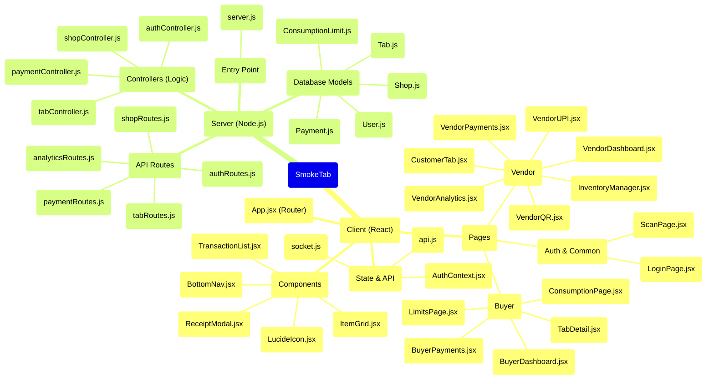

# 🧠 SmokeTab File Architecture Mind Map

Below is a visual mind map representing how all the major files in the SmokeTab application are organized and connected. It's broken down by the **Client (React Frontend)** and the **Server (Node/Express Backend)**.

### 🔗 How They Connect:
1. **The Flow**: When a user clicks a button on a **Page** (e.g., `VendorDashboard.jsx`), it triggers an API call defined in `api.js`.
2. **The Backend**: The API request goes to `server.js`, which routes it through the **Routes** (e.g., `shopRoutes.js`).
3. **The Logic**: The route passes the request to the matching **Controller** (e.g., `shopController.js`).
4. **The Database**: The controller reads or writes data using the **Database Models** (e.g., `Shop.js`), then sends the response back to the client!
