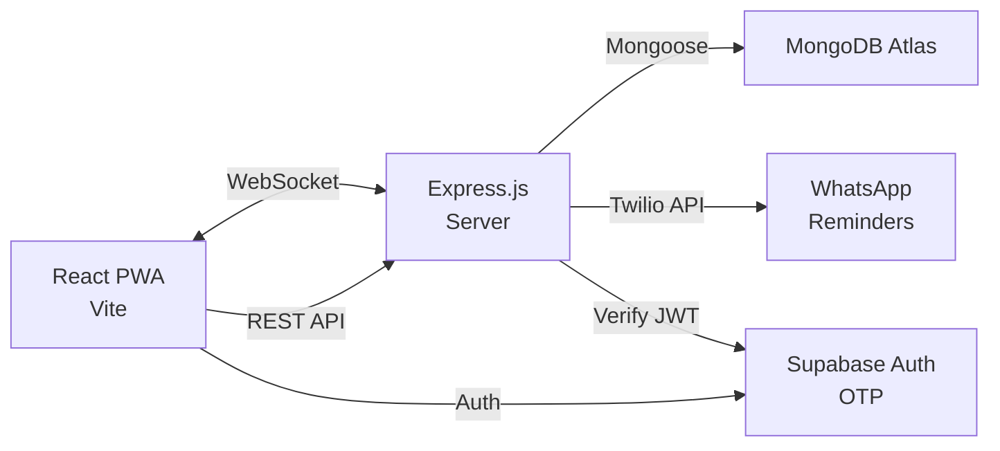
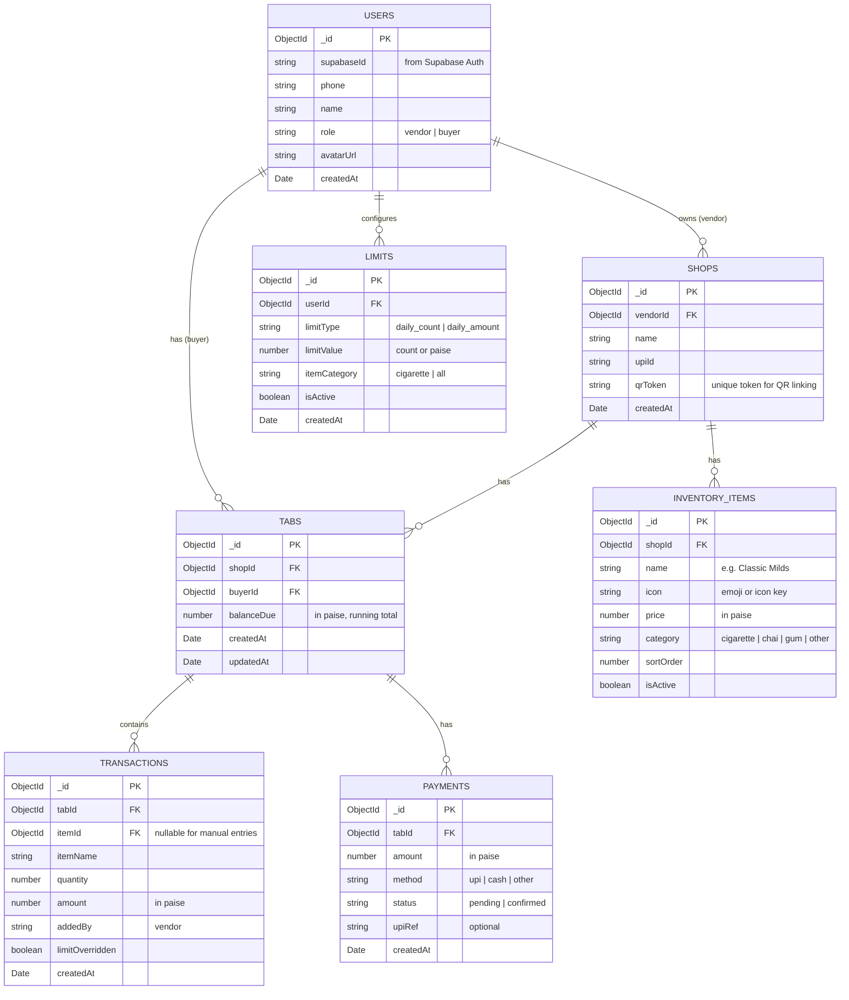

# SmokeTab — Implementation Plan (v2)

A digital "buy now, pay later" tab system PWA for small shop vendors (tapri/paan shops) and their regular customers.

---

## Tech Stack

| Layer | Technology | Rationale |
|---|---|---|
| **Frontend** | Vite + React 18 | Fast dev server, excellent DX, PWA plugin support |
| **PWA** | `vite-plugin-pwa` + Workbox | Auto service worker, offline caching, installability |
| **Styling** | Vanilla CSS (custom design system) | High-contrast, mobile-first, icon-heavy per PRD |
| **Routing** | React Router v6 | Client-side routing with role-based guards |
| **Charts** | Chart.js via `react-chartjs-2` | Lightweight consumption/analytics graphs |
| **QR Codes** | `qrcode.react` + `html5-qrcode` | Generate & scan QR codes in-app |
| **Auth** | Supabase Auth | OTP phone authentication |
| **Backend API** | Express.js + Node.js | REST API server connecting to MongoDB |
| **Database** | MongoDB Atlas + Mongoose | Document DB, flexible schema, hosted cluster |
| **Realtime** | Socket.io | Real-time tab sync (replaces Supabase Realtime, which only works with PostgreSQL) |
| **Payments** | UPI deep links + QR fallback | No payment gateway dependency; direct UPI |
| **WhatsApp** | Twilio WhatsApp API (via backend cron) | Automated weekly reminders |
| **Fonts** | Google Fonts (Inter) | Clean, modern typography |

> [!NOTE]
> **Why Express + Socket.io?** Supabase Realtime is built on PostgreSQL's WAL. Since we're using MongoDB, we need Socket.io for real-time tab sync. The Express server also gives us a proper API layer for business logic, limit checks, and payment processing.

---

## Architecture Overview



**Flow:**
1. User authenticates via **Supabase Auth** (phone OTP) → gets a JWT
2. Frontend sends JWT in `Authorization` header to **Express server**
3. Express verifies the JWT against Supabase → extracts user ID
4. Express performs CRUD on **MongoDB Atlas** via Mongoose
5. Real-time updates pushed to connected clients via **Socket.io**

---

## User Review Required

> [!IMPORTANT]
> **MongoDB Atlas Cluster:** You will need a MongoDB Atlas account + cluster. For development, the free M0 tier works perfectly. You'll provide the connection string (`MONGODB_URI`).

> [!IMPORTANT]
> **Supabase Project:** You still need a Supabase project for phone OTP auth. Create one at [supabase.com](https://supabase.com) and provide the URL + anon key. For initial dev, we'll use mock auth mode.

> [!IMPORTANT]
> **WhatsApp Reminders:** Twilio integration requires account + Meta Business verification. We'll build the endpoint but stub the actual sending until you configure credentials.

> [!WARNING]
> **UPI Payments:** `upi://pay?...` deep links only work on mobile browsers with UPI apps. On desktop, we show a QR code. Vendor manually marks payments as "received" (no server-side verification without a payment gateway).

---

## Database Schema (MongoDB / Mongoose)



---

## Project File Structure

```
money_app/
├── client/                            # React PWA (Vite)
│   ├── public/
│   │   ├── favicon.ico
│   │   ├── pwa-192x192.png
│   │   └── pwa-512x512.png
│   ├── src/
│   │   ├── main.jsx                   # App entry point
│   │   ├── App.jsx                    # Router + layout
│   │   ├── index.css                  # Global design system
│   │   │
│   │   ├── lib/
│   │   │   ├── supabase.js            # Supabase Auth client
│   │   │   ├── api.js                 # Axios instance (points to Express)
│   │   │   ├── socket.js              # Socket.io client
│   │   │   └── helpers.js             # Utility functions
│   │   │
│   │   ├── contexts/
│   │   │   └── AuthContext.jsx        # Auth state provider
│   │   │
│   │   ├── components/
│   │   │   ├── Layout.jsx             # App shell (header + bottom nav)
│   │   │   ├── BottomNav.jsx          # Mobile bottom navigation
│   │   │   ├── ProtectedRoute.jsx     # Auth + role guard
│   │   │   ├── QRCodeDisplay.jsx      # Show vendor QR
│   │   │   ├── QRCodeScanner.jsx      # Scan QR to link
│   │   │   ├── ItemGrid.jsx           # Quick-add inventory grid
│   │   │   ├── TransactionList.jsx    # Scrollable transaction list
│   │   │   ├── ConsumptionChart.jsx   # Chart.js graphs
│   │   │   ├── LimitWarningModal.jsx  # "Limit reached!" popup
│   │   │   ├── PaymentModal.jsx       # UPI pay / QR display
│   │   │   └── LoadingSpinner.jsx     # Loading state
│   │   │
│   │   ├── pages/
│   │   │   ├── auth/
│   │   │   │   ├── LoginPage.jsx      # Phone + OTP
│   │   │   │   └── RoleSelectPage.jsx # Vendor or Buyer
│   │   │   │
│   │   │   ├── vendor/
│   │   │   │   ├── VendorDashboard.jsx
│   │   │   │   ├── CustomerTab.jsx    # Individual customer ledger + POS
│   │   │   │   ├── InventoryManager.jsx
│   │   │   │   ├── VendorAnalytics.jsx
│   │   │   │   └── VendorQR.jsx
│   │   │   │
│   │   │   ├── buyer/
│   │   │   │   ├── BuyerDashboard.jsx
│   │   │   │   ├── TabDetail.jsx
│   │   │   │   ├── ConsumptionPage.jsx
│   │   │   │   └── LimitsPage.jsx
│   │   │   │
│   │   │   └── common/
│   │   │       ├── ScanPage.jsx
│   │   │       └── NotFoundPage.jsx
│   │   │
│   │   └── hooks/
│   │       ├── useAuth.js
│   │       ├── useSocket.js           # Socket.io realtime hook
│   │       └── useConsumptionData.js
│   │
│   ├── index.html
│   └── vite.config.js
│
├── server/                            # Express.js Backend
│   ├── src/
│   │   ├── app.js                     # Express app setup + middleware
│   │   ├── server.js                  # HTTP + Socket.io server start
│   │   │
│   │   ├── config/
│   │   │   ├── db.js                  # MongoDB Atlas connection (Mongoose)
│   │   │   └── supabase.js            # Supabase admin client (JWT verify)
│   │   │
│   │   ├── middleware/
│   │   │   ├── auth.js                # Verify Supabase JWT → attach user
│   │   │   └── errorHandler.js        # Global error handling
│   │   │
│   │   ├── models/
│   │   │   ├── User.js
│   │   │   ├── Shop.js
│   │   │   ├── InventoryItem.js
│   │   │   ├── Tab.js
│   │   │   ├── Transaction.js
│   │   │   ├── Payment.js
│   │   │   └── Limit.js
│   │   │
│   │   ├── routes/
│   │   │   ├── authRoutes.js          # POST /api/auth/register (role select)
│   │   │   ├── shopRoutes.js          # CRUD shops + inventory
│   │   │   ├── tabRoutes.js           # Tab management + transactions
│   │   │   ├── paymentRoutes.js       # Record payments
│   │   │   ├── limitRoutes.js         # CRUD limits
│   │   │   └── analyticsRoutes.js     # Vendor analytics queries
│   │   │
│   │   ├── controllers/
│   │   │   ├── authController.js
│   │   │   ├── shopController.js
│   │   │   ├── tabController.js
│   │   │   ├── paymentController.js
│   │   │   ├── limitController.js
│   │   │   └── analyticsController.js
│   │   │
│   │   ├── socket/
│   │   │   └── socketHandler.js       # Socket.io event handlers (tab updates)
│   │   │
│   │   └── jobs/
│   │       └── whatsappReminder.js    # Cron job: weekly WhatsApp reminders
│   │
│   ├── package.json
│   └── .env                           # MONGODB_URI, SUPABASE_URL, SUPABASE_SERVICE_KEY, TWILIO_*
│
├── .gitignore
└── README.md
```

---

## Proposed Changes — Phased Build

### Phase 1: Project Bootstrap & Design System

#### [NEW] Client — Vite + React setup
- Init with `npx create-vite@latest ./client --template react`
- Install deps: `react-router-dom`, `@supabase/supabase-js`, `qrcode.react`, `html5-qrcode`, `react-chartjs-2`, `chart.js`, `vite-plugin-pwa`, `axios`, `socket.io-client`

#### [NEW] Server — Express setup
- Init with `npm init -y` in `/server`
- Install deps: `express`, `mongoose`, `cors`, `dotenv`, `socket.io`, `@supabase/supabase-js`, `node-cron`, `helmet`, `morgan`
- Dev deps: `nodemon`

#### [NEW] [index.css](file:///Users/sameerchoudhary/Desktop/money_app/client/src/index.css)
- Full design system: CSS custom properties for colors, spacing, typography
- High-contrast dark theme (outdoor visibility)
- Glassmorphism card styles, button grid, animations

#### [NEW] [vite.config.js](file:///Users/sameerchoudhary/Desktop/money_app/client/vite.config.js)
- React plugin + PWA plugin with manifest
- Proxy `/api` to Express server during dev

---

### Phase 2: Backend Foundation

#### [NEW] [db.js](file:///Users/sameerchoudhary/Desktop/money_app/server/src/config/db.js)
- Mongoose connection to MongoDB Atlas
- Connection error handling + retry logic

#### [NEW] [supabase.js](file:///Users/sameerchoudhary/Desktop/money_app/server/src/config/supabase.js)
- Supabase admin client (service role key) for JWT verification

#### [NEW] [auth.js middleware](file:///Users/sameerchoudhary/Desktop/money_app/server/src/middleware/auth.js)
- Extract Bearer token from Authorization header
- Verify via `supabase.auth.getUser(token)`
- Attach user info to `req.user`

#### [NEW] All Mongoose Models
- `User`, `Shop`, `InventoryItem`, `Tab`, `Transaction`, `Payment`, `Limit`
- Schema validation, indexes on foreign keys, timestamps

#### [NEW] [app.js](file:///Users/sameerchoudhary/Desktop/money_app/server/src/app.js) + [server.js](file:///Users/sameerchoudhary/Desktop/money_app/server/src/server.js)
- Express app with CORS, helmet, JSON parsing, morgan logging
- Socket.io attached to HTTP server
- Route mounting

---

### Phase 3: Auth & App Shell (Frontend)

#### [NEW] [supabase.js](file:///Users/sameerchoudhary/Desktop/money_app/client/src/lib/supabase.js)
- Supabase client init from env vars (auth only)

#### [NEW] [api.js](file:///Users/sameerchoudhary/Desktop/money_app/client/src/lib/api.js)
- Axios instance with base URL + auth interceptor (attaches Supabase JWT)

#### [NEW] [socket.js](file:///Users/sameerchoudhary/Desktop/money_app/client/src/lib/socket.js)
- Socket.io client, connects with auth token

#### [NEW] [AuthContext.jsx](file:///Users/sameerchoudhary/Desktop/money_app/client/src/contexts/AuthContext.jsx)
- `signInWithOtp`, `verifyOtp`, `signOut`
- Fetches user profile from Express `/api/auth/me`
- Stores role + profile in context

#### [NEW] Auth Pages — `LoginPage.jsx`, `RoleSelectPage.jsx`
#### [NEW] App Shell — `Layout.jsx`, `BottomNav.jsx`, `ProtectedRoute.jsx`

---

### Phase 4: Vendor POS & Ledger

#### [NEW] API Routes + Controllers
- `POST /api/shops` — create shop
- `GET/PUT /api/shops/:id/inventory` — manage items
- `POST /api/tabs/:tabId/transactions` — add item (with limit check)
- `DELETE /api/tabs/:tabId/transactions/:txId` — remove entry

#### [NEW] Socket Events
- `tab:item-added` — broadcast to buyer when vendor adds item
- `tab:item-removed` — broadcast on deletion
- `tab:payment-received` — broadcast on payment confirmation

#### [NEW] Frontend Pages
- `VendorDashboard.jsx` — customer list + balances
- `CustomerTab.jsx` — POS with ItemGrid + transaction list
- `InventoryManager.jsx` — manage quick-add items
- `ItemGrid.jsx` — tappable button grid component
- `LimitWarningModal.jsx` — override prompt

---

### Phase 5: Buyer Dashboard & Tracking

#### [NEW] API Routes
- `GET /api/tabs` — buyer's tabs with vendors
- `GET /api/tabs/:id/consumption` — aggregated stats
- `POST /api/limits` — set daily limits
- `GET /api/limits` — get active limits

#### [NEW] Frontend Pages
- `BuyerDashboard.jsx` — vendor list + balances
- `TabDetail.jsx` — real-time transaction list (Socket.io)
- `ConsumptionPage.jsx` — charts + trends
- `LimitsPage.jsx` — set/toggle limits
- `ConsumptionChart.jsx` — Chart.js wrapper

---

### Phase 6: QR Linking, Payments, Analytics, WhatsApp

#### [NEW] QR System
- `POST /api/tabs/link` — create tab from QR scan (validates token)
- `QRCodeDisplay.jsx` — render vendor QR
- `QRCodeScanner.jsx` — camera scan + API call

#### [NEW] Payments
- `POST /api/payments` — record payment (full/partial)
- `PUT /api/payments/:id/confirm` — vendor confirms receipt
- `PaymentModal.jsx` — UPI deep link (mobile) or QR (desktop)

#### [NEW] Analytics
- `GET /api/analytics/exposure` — total outstanding
- `GET /api/analytics/top-debtors` — sorted debtor list
- `VendorAnalytics.jsx` — charts + stats

#### [NEW] WhatsApp Cron
- `whatsappReminder.js` — node-cron weekly job
- Queries all tabs with balance > 0, sends Twilio message
- Stub until credentials configured

---

## Design System Highlights

| Token | Value | Usage |
|---|---|---|
| `--color-bg` | `#0a0a0f` | Main background (deep dark) |
| `--color-surface` | `#1a1a2e` | Cards, modals |
| `--color-primary` | `#00d4aa` | Primary actions, accents (mint green) |
| `--color-danger` | `#ff4757` | Warnings, overdue amounts |
| `--color-warning` | `#ffa502` | Limit alerts |
| `--color-text` | `#e8e8e8` | Primary text (high contrast) |
| `--radius` | `16px` | Rounded corners |
| `--font` | `'Inter', sans-serif` | Clean typography |

- Dark theme for outdoor/sunlight readability
- Large tap targets (min 48px)
- Glassmorphism cards with blur + border
- Smooth page transitions + micro-animations

---

## Open Questions

> [!IMPORTANT]
> **Mock Mode for Development?** I'll build the full UI with mock data first so you can see and interact with everything locally without needing Supabase/MongoDB credentials immediately. We wire up the real backend once you set up your accounts. Does this work?

> [!IMPORTANT]
> **Shop Name & UPI ID:** Collected during vendor onboarding (role selection), or via a separate settings page?

---

## Verification Plan

### Automated Tests
- `npm run build` (client) — verify production build succeeds
- `node server/src/server.js` — verify server starts & connects to mock DB
- Lighthouse PWA audit on built client

### Manual Verification
1. **Auth flow**: Login → OTP → Role select → Dashboard
2. **Vendor POS**: Add items → see balance update → edit/delete
3. **QR Linking**: Generate QR → scan → verify tab created
4. **Buyer sync**: Vendor adds item → buyer sees it in real-time (Socket.io)
5. **Limits**: Set limit → exceed → verify warning modal
6. **Payments**: "Pay Dues" → UPI deep link (mobile) or QR (desktop)
7. **Analytics**: Totals, top debtors, charts
8. **PWA**: Install to home screen, offline shell loads
